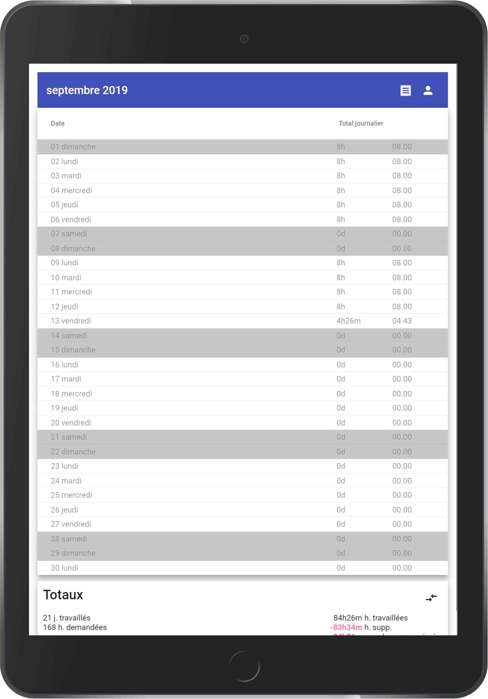
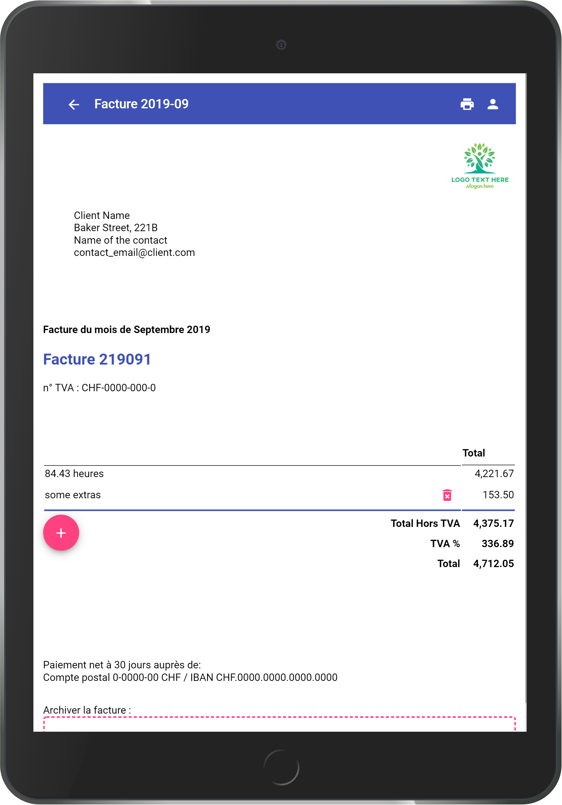
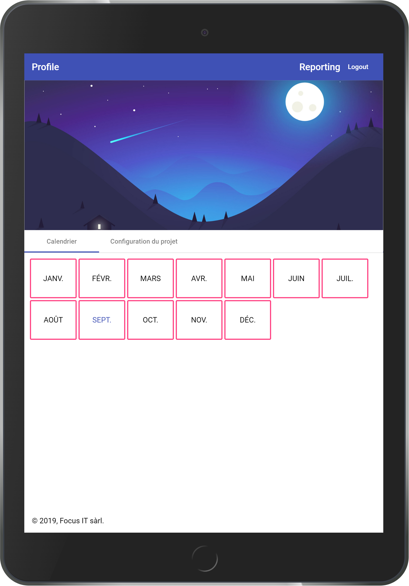

# Timbrage - reporting quotidien

_Application d'aide au reporting quotidien, outils de productivité._

Cette application permet d'enregistrer rapidement et simplement son temps de travail quotidien, pratique pour la facturation au client ;)

Le code est **open source sous license Apache 3.0** pour permettre une transparence total aux usagés de l'application et la pérénité de cette transparence.

Read [CONTRIBUTING](CONTRIBUTING.md) file to contrib

## Timbrage application

_Also deployed on [Google Play store](https://play.google.com/store/apps/details?id=ch.ifocusit.reporting.timbrage)_.

## Administration application

# Developper zone

[Project dashboard](https://github.com/ifocusit/reporting/projects/1)

In this monorepo, you will find this great tools :

1. [@angular](https://angular.io/)
2. [@angular/material](https://material.angular.io/)
3. [@angular/flex-layout](https://github.com/angular/flex-layout)
4. [@ngxs](https://www.ngxs.io/)
5. [firebase](https://firebase.google.com/)
6. [@ngx-translate](https://github.com/ngx-translate/core)
7. @angular/pwa : [Progressive Web Application](https://fr.wikipedia.org/wiki/Progressive_web_app)
8. TWA : [Trusted Web Application](https://codelabs.developers.google.com/codelabs/getting-started-with-twas/index.html#0)
9. NX workspace: [Extensible Dev Tools for Monorepos](https://nx.dev/)

Other great tools that help in my developpements:

- [Icons - Material Design](https://material.io/resources/icons/?style=baseline)
- [Icons - Font Awesome](https://fontawesome.com/icons?d=gallery&m=free)
- [Color Tool - Material Design](https://material.io/resources/color/#!/?view.left=0&view.right=0&primary.color=B71C1C)
- [Color - Material-UI](https://material-ui.com/customization/color/#color-tool)
